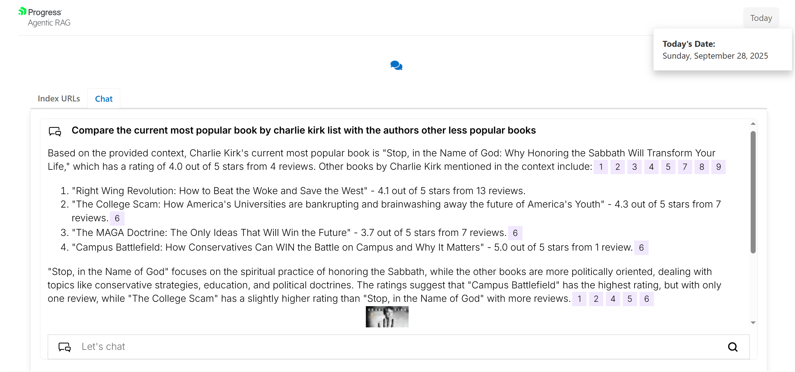

# RAGgle

This project is a custom, conversational search engine powered by Nuclia's RAG (Retrieval Augmented Generation) technology. It allows users to index content from various websites and interact with an AI-powered chat assistant to get insights about the indexed content. Users can also filter their indexed URL history by date range for better organization. The frontend is built with React and KendoReact components, while the backend is a Flask application that interfaces with the Nuclia API.

## How It Works

The screenshot below demonstrates how RAGgle uses cross-referenced data to answer complex questions. In this example, the AI assistant compares Charlie Kirk's most popular book with his other works by analyzing indexed content from multiple sources, providing detailed ratings, review counts, and thematic comparisons across his entire catalog.



*Example: AI assistant comparing books by Charlie Kirk using cross-referenced data from indexed content*

## Features

*   **URL Indexing**: Index content from various websites into a Nuclia Knowledge Base with date-based filtering of the indexed URL history.
*   **AI Chat Assistant**: Integrated Nuclia chat widget for conversational queries and answers about indexed content.
*   **Minimalist UI**: Responsive and interactive user interface built with React and KendoReact components.

## Nuclia Metadata Collection

Nuclia automatically extracts and classifies the following metadata from indexed content:

**Document Classification Labels:**
- `features` (metadata)
- `availability` (metadata)
- `name` (metadata)
- `price` (metadata)
- `supplier` (metadata)
- `category` (metadata)
- `productUrl` (metadata)
- `imageUrl` (metadata)
- `description` (metadata)
- `rating` (metadata)

This structured metadata enables sophisticated search capabilities and allows the AI assistant to provide detailed, contextual responses about indexed products and content.

## Prerequisites

Before running the application, ensure you have the following installed:

*   **Python 3.8+**: For the backend Flask application.
*   **pip**: Python package installer (usually comes with Python).
*   **Node.js 18+**: For the frontend React application.
*   **npm** or **Yarn**: Node.js package manager (npm comes with Node.js).

## Setup and Installation

Follow these steps to get the application running on your local machine.

### 1. Environment Variables

Both the backend and frontend require Nuclia API credentials and Knowledge Base IDs.

Create a `.env` file in the `backend/` directory with the following content:

```env
NUCLIA_API_KEY="YOUR_NUCLIA_API_KEY"
NUCLIA_KB_UID="YOUR_ECOMMERCE_KNOWLEDGE_BASE_ID"
SUPABASE_URL="YOUR_SUPABASE_PROJECT_URL"
SUPABASE_ANON_KEY="YOUR_SUPABASE_ANON_KEY"
```

- Replace "YOUR_NUCLIA_API_KEY" with your actual Nuclia API Key.
- Replace NUCLIA_KB_UID with your Nuclia Knowledge Box UID.
- Replace "YOUR_SUPABASE_PROJECT_URL" with your Supabase project URL from your dashboard.
- Replace "YOUR_SUPABASE_ANON_KEY" with your Supabase anon key from your dashboard.

### 1. Backend Setup

Navigate to the backend/ directory and install the Python dependencies:

```
cd backend
pip install -r requirements.txt
```

### 2. Environment Variables

Set up your Nuclia API credentials:

1. Copy the example environment file:
   ```
   cd backend
   cp .env.example .env
   ```

2. Edit the `.env` file and replace the placeholder values with your actual Nuclia credentials:
   ```env
   NUCLIA_WRITER_API_KEY="your_actual_NUCLIA_WRITER_API_KEY"
   NUCLIA_READER_API_KEY="your_actual_NUCLIA_READER_API_KEY"
   NUCLIA_KB_UID="your_actual_knowledge_base_id"
   SUPABASE_URL="your_actual_supabase_project_url"
   SUPABASE_ANON_KEY="your_actual_supabase_anon_key"
   ```

**Where to get these values:**
- **NUCLIA_WRITER_API_KEY**: Get this from your [Nuclia dashboard](https://nuclia.cloud/) - requires Edit API permissions for indexing content
- **NUCLIA_READER_API_KEY**: Get this from your [Nuclia dashboard](https://nuclia.cloud/) - requires Search API permissions for searching and chat functionality
- **NUCLIA_KB_UID**: Create a new Knowledge Base in your Nuclia dashboard and copy its ID
- **SUPABASE_URL**: Get this from your [Supabase dashboard](https://supabase.com/dashboard) under Settings > API
- **SUPABASE_ANON_KEY**: Get this from your [Supabase dashboard](https://supabase.com/dashboard) under Settings > API

### 3. Frontend Setup

Navigate to the frontend/ directory and install the Node.js dependencies:

```
cd frontend
npm install # or npx react-scripts start
```


### 4. Supabase Database Schema Setup

After setting up your Supabase project and adding the environment variables, you need to create the database schema for product storage and price tracking.

**📋 [Complete Supabase Database Setup Instructions](docs/SUPABASE_SETUP.md)**

This includes:
- Creating the `products` table for storing indexed product information
- Creating the `price_history` table for tracking price changes over time
- Setting up proper indexes for optimal performance
- Optional Row Level Security configuration

### 5. Running the Application

You will need to run both the backend and frontend servers concurrently.

#### Start the Backend Server

From the backend/ directory, run the Flask application:

```
cd backend
python app.py
```

The backend server will run on http://127.0.0.1:5000. You should see log messages indicating it's running.

#### Start the Frontend Server

From the frontend/ directory, start the React development server:

```
cd frontend
npm start # or yarn start
```

The frontend application will open in your browser, usually at http://localhost:3000.

## Usage

Once both servers are running, you can interact with the application:

1. Navigate to the Frontend: Open your web browser and go to http://localhost:3000.
2. Index URLs:
- Click on the "Index URLs" tab.
- Enter a URL from any website into the input field.
- Optionally, provide a custom title.
- Click "Index URL" to send the content to your Nuclia Knowledge Base.
- Use the date range filters to view indexed URLs from specific time periods.
3. AI Chat:
- Click on the "AI Chat" tab.
- Interact with the Nuclia chat widget to ask questions about your indexed content.

## Technologies Used

**Frontend:**
- React
- KendoReact (UI Components)
- Axios (HTTP Client)
- CSS
**Backend:**
- Flask (Web Framework)
- Python
- Requests (HTTP Client)
- python-dotenv (Environment Variable Management)
- Nuclia API
**AI/RAG:**
- Nuclia (for indexing, semantic search, query rephrasing, and AI chat)

##

This application was built for the Progress KendoReact Challenge
